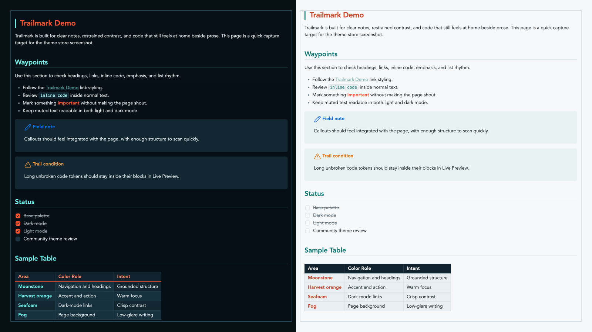

# Trailmark

Trailmark is an Obsidian theme built for focused notes, technical writing, and field-ready documentation. It uses a restrained outdoor-industrial palette: deep moonstone, warm harvest orange, crisp seafoam, soft fog, and clean cloud surfaces.

Repository: <https://github.com/joshua-walls/trailmark-theme>



## Design

Trailmark is meant to feel grounded and practical rather than decorative. It favors clear hierarchy, readable contrast, and small moments of color that help you scan a page without turning your vault into a dashboard.

- **Moonstone** gives the theme its structure: navigation, table headers, and strong page framing.
- **Harvest orange** is used for emphasis, action, and high-signal accents.
- **Seafoam** keeps dark-mode links and secondary highlights crisp.
- **Fog and cloud** keep light mode calm and low-glare.
- **Dark surfaces** are layered so notes, callouts, code, and metadata stay visually distinct.

## Reading Experience

Headings are intentionally expressive: H1 carries the warm Trailmark accent, while H2 and supporting headings use cooler tones to keep long notes organized. Links, tags, highlights, checkboxes, and inline code each get their own treatment so dense notes remain easy to parse.

Trailmark is tuned for both Live Preview and Reading View, including long code tokens that should wrap inside code blocks instead of escaping the editor.

## Callouts

Callouts are designed to feel integrated with the page. They use quiet filled surfaces, strong icon/title color, and generous spacing so they stand out without shouting.

The goal is to make notes, warnings, and field observations visible at a glance while keeping the surrounding document calm.

## Code and Tables

Code blocks use a framed surface with a colored left rail, giving snippets enough presence without overwhelming prose. Inline code is compact and readable, with enough contrast to work inside normal paragraphs.

Tables use a strong header row, clear cell borders, and restrained alternating surfaces. They are meant to support quick comparison in operational notes, documentation, inventories, and reviews.

## Tasks and Metadata

Task checkboxes use Trailmark accent colors so completed work is obvious without becoming noisy. Metadata and properties are styled as quiet panels that stay readable in both dark and light mode.

## Install manually

1. Download the latest release zip.
2. Unzip it into your vault's `.obsidian/themes/` folder.
3. In Obsidian, open Settings, then Appearance, then Themes.
4. Select `Trailmark`.

The installed folder should contain:

```text
Trailmark/
  manifest.json
  theme.css
```
